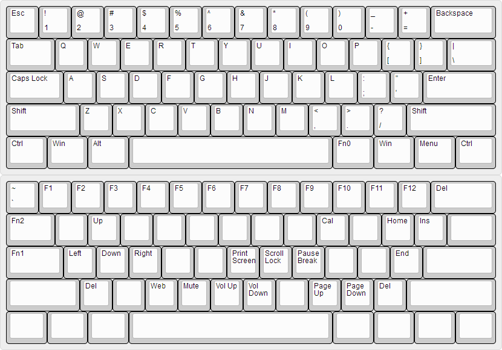

=================
Lot60-BLE使用指南
=================

概述
========

Lot60-BLE 是一款低功耗蓝牙双模键盘。其固件底层使用了TMK作为键盘功能核心，几乎完全实现了TMK功能 [1]_。其采用了与GH60完全一致的按键阵列，使其配列文件与GH60几乎完全兼容 [2]_。

产品亮点
--------

- 功耗极低，使用时间极长
- 蓝牙/USB双模随时切换
- 支持多种配列
- 图形化改键，全键可编程
- 蓝牙支持多设备切换（WIP）
- 支持全键无冲
- 支持按键宏
- 支持多媒体键和系统键

产品附件
--------

部分产品可能会包含以下附件：

- 备件二极管：若键盘阵列二极管在外力作用下脱落，可以使用此备件替换。
- 微动按钮：键盘上的Reset按钮和ISP按钮在默认情况下是未焊接状态的。若有需要，可以将此按钮焊接在线路板上。

接口图
---------

.. figure:: res/lot60_revg_draw.png
   :alt: 接口图

1. 电池接口
2. GPIO接口
3. 充满指示灯 (仅Rev.G)
4. USB Type-C 通信接口
5. 充电指示灯 (仅Rev.G)
6. 板载调试器跳线 (仅Rev.G)
7. ISP 按钮 (Rev.E和F版本的此按钮在空格附近)
8. Reset 按钮

.. _hardware-ver:

硬件版本
----------

键盘PCB背面空格下方，写着“Lot60-BLE REV.X”，X即为你的硬件版本。

不同的硬件版本通常会有不同的功能，各版本主要区别如下：

=====  ==========  ==============  ======  ==========
版本   双电源供电  独立充电指示灯  64配列  板载调试器
=====  ==========  ==============  ======  ==========
Rev.E  不支持      不支持          不支持  不支持
Rev.F  支持        不支持          不支持  不支持
Rev.G  支持        支持            支持    支持
=====  ==========  ==============  ======  ==========

LED 一览
--------

Lot60-BLE 包含了1个CapsLock LED 和一个 RGB LED 指示灯，并预留了3个单色LED状态指示灯的位置。

本产品默认使用 RGB 状态指示灯。此状态指示灯位于 Esc 按键处，使用贴片LED灯，故需要使用贴片RGB轴。

如果不想使用RGB轴，可以放弃这个LED灯，转而使用位于按键1, 2, 3处的LED指示灯（参见：:ref:`3-led-instruction`）。

使用手册
========

快速入门
--------

1. （如果购买的是散件）按照线路板上的标识，根据BOM表焊接相应的元件。
2. 将电池插入电池插口。注意电池的线序，红色线对应“+”标记，黑色线对应“-”标记。

.. warning::

   请务必注意电池的正负极。电池正负极反接可能会损坏键盘。

3. 使用USB线连接到你的电脑。如果电脑能够成功的识别到名字类似“Lot60.X”的设备，说明USB芯片工作正常。
4. 此时，LED 指示灯会亮起。如果指示灯没有自动亮起，可以尝试按住 ``Space+U`` 开机。
5. 使用镊子短路任意一个按键，若电脑有反应，则说明整机工作正常。
6. 组装你的键盘。注意要先装定位板，再装轴哦~
7. 好了，你的Lot60-BLE键盘已经组装完成了。插上USB尝试一下吧！

默认配列
--------

   默认配列图

图中Fn1是休眠，Fn2是切换设备。按住Fn0键会临时启用第2层，即 ``Fn0+Tab`` 切换USB和蓝牙设备，\ ``Fn0+CapsLock``\ 休眠键盘。

开机
--------

同时按下\ ``Space(空格)+U``\ ，直到LED指示灯亮起即可开机。

插入USB的同时键盘会自动开机。

省电模式
--------

在没有接入USB电源的情况下，键盘处于省电模式。

在省电模式下，所有的指示灯仅在变化后亮起5秒，然后熄灭。键盘在无操作15秒后转入慢速扫描模式，无操作600秒后自动休眠。

慢速扫描模式下，按键检测将可能略有延迟。在慢速扫描模式下按任意按键即可恢复到快速扫描模式。

自动休眠后，按下键盘的任意按键即可再次唤醒。

.. _sleep:

休眠键盘
--------

在默认配列下，按下\ ``Fn0+CapsLock``\ ，即可让键盘进入休眠状态。

如果键盘按键错乱导致无法休眠，请尝试 :ref:`强制休眠键盘 <force-sleep>`

手动休眠后，需要手工按下\ ``Space+U``\ 才能再次唤醒。

蓝牙连接设备
------------

在键盘开机的状态下，使用你要连接设备的蓝牙搜索功能搜索蓝牙设备。
你会见到一个叫做\ ``Lot60.X_XXXXXX``\ 的设备，使用你的主机设备连接此蓝牙设备，
若提示输入配对码，请在键盘上输入配对码即可。

USB 连接设备
--------------

直接将USB线缆插入到键盘的USB接口，键盘会自动切换至USB模式。这时候就可以使用USB模式输入了。

USB/蓝牙状态切换
--------------------

在默认配列下，按下\ ``Fn0+Tab``\ ，即可在USB和蓝牙两种模式下切换。

电量显示
--------

键盘会自动上报当前的电量信息给蓝牙连接的主机，可以直接在主机上查看电量百分比。

.. note::

   蓝牙电量上报仅支持 iOS 10+、安卓 6+、Windows 10 1903+，以及部分新版Linux发行版。
   MacOS暂时不支持此功能。

由于测量方式可能有误差，电量百分比可能无法达到100%或者低至0%，这是正常现象。电量百分比仅供参考。

对于安卓手机，如果没有正确的显示电量，可以尝试下载BatON软件来获取蓝牙设备电量。

RGB 指示灯颜色说明
------------------

.. note::
   此颜色可能和实际颜色有略微色差

-  白色：无连接
-  青色：蓝牙已连接
-  天蓝色：USB已连接
-  橙色：充电中 (Rev.G 除外)
-  绿色：充电完毕 (Rev.G 除外)
-  黄色：输入配对密码
-  紫红色：配对密码输入完毕
-  紫色：休眠

.. _unbond-device:

删除蓝牙绑定
--------------

若想要连接到其他的蓝牙设备，或蓝牙连接不正常，则可尝试以下删除所有绑定。

1. 手动 :ref:`休眠键盘 <sleep>`
2. 在开机时按下\ ``Space+E``\ 即可删除绑定。（即在休眠后，同时按下Space+U+E开机）

全键无冲（NKRO）
------------------

此键盘支持NKRO（全键无冲）模式，但默认不启用全键无冲。全键无冲仅在USB模式下才可使用。

按下NKRO切换键即可切换全键无冲的状态。

.. note::

   此操作仅适用于固件版本 1.1.0.0 及以后的固件。
   对于1.0.3.1及以前的固件，请在键盘开机时按下\ ``Space+N``\ （即在休眠后，按下Space+U+N开机）切换全键无冲的状态。

其他功能键（BootMagic）
---------------------------

.. warning::

   除解除绑定功能和进入DFU模式外，此章节的其他所有功能均已在固件版本 1.1.0.0 及以后的固件中废弃。

以下是所有的开机时功能键的列表，你可以在开机时同时按下Space+下面的键来实现对应的功能。(即，在休眠后同时按下Space+U+下面的键开机，或按住Space+下面的键再插入USB开机。)

需要注意的是，下面的按键全部都指的是当前配列的第0层按键。如果你更改了配列，那么这些按键的位置可能会发生变化。

-  E: 擦除蓝牙绑定
-  B: 进入DFU模式
-  Esc：跳过Bootmagic
-  Backspace：重置eeconfig
-  LCtrl：交换capslock和左ctrl
-  CapsLock: 将capslock用作ctrl
-  LAlt：交换LAlt和LGUI
-  RAlt: 交换RAlt和RGUI
-  LGUI：禁用GUI按钮
-  \`(1左边那个, Grave): 交换Esc和Grave
-  \\: 交换:raw-latex:`\和Backspace`
-  N：切换NKRO状态
-  0~7：设置默认层为对应数字的层

配置键盘与更改配列
------------------

访问 `Lotlab 键盘配置工具 <https://keyboard.lotlab.org/>`__ ，即可修改键盘的配置和配列，具体操作方法请查阅此网站的帮助页面。

.. note::

   若此网站无法访问，也可以访问以下几个镜像站点：
   
   -  https://keyboard.lotlab.icu
   -  https://kb.lotkb.cn

   若需要在离线状态下修改键盘配置，请访问上述站点下载配置工具。配置工具可以在断网的情况下使用，请根据配置工具启动后的指示进行操作。

有两种方式可以修改键盘的配列：

1. 使用 Lotlab 键盘配置工具，直接将键盘的配置和配列写入键盘；
2. 将上面网站配置的配列导出为EEP文件，使用 `配列下载工具(KeymapDownloader.exe) <https://github.com/Lotlab/nrf52-keyboard/releases>`__ 写入键盘。

无论是哪种方式，都需要将键盘使用USB连接到电脑。

.. note::

   方法一仅适用于固件版本 1.1.0.0 及以后的固件。对于1.0.3.1及以前的固件，仅能使用方法二修改配列。
   
   方法二仅能修改配列，不能修改键盘配置。

固件更新
----------

参见 :doc:`通用固件更新教程 <upgrade>`

.. _force-sleep:

强制休眠键盘
-------------

若休眠按键无法正常休眠键盘，则可以尝试下面的方法强制休眠键盘。

-  方法1：将键盘放置15分钟，其会自动转入休眠状态。
-  方法2：按下键盘背面的RESET按钮，键盘即进入休眠状态。
-  方法3：拔下键盘的USB线和电池，再重新插上。

.. _enter-dfu:

进入DFU模式
---------------

DFU 模式是一个特殊的键盘模式，用于更新键盘蓝牙固件。

-  方法1：

   1. 将\ `键盘休眠 <#休眠键盘>`__\ ；
   2. 在唤醒的同时按下\ ``Space+B``\ ；
   3. 蓝牙会搜索到一个名为\ ``DFUTarg``\ 的设备，表明已经进入DFU模式了。

-  方法2：

   1. 将键盘翻到背面，找到GPIO0接口。
   2. 使用镊子将GPIO0接口与GND接口连接。
   3. 将键盘的电池断开并重新连接，或按下RESET按钮使键盘强制重启。
   4. 蓝牙会搜索到一个名为\ ``DFUTarg``\ 的设备，表明已经进入DFU模式了。进入DFU模式后即可断开GPIO0和GND的连接。

退出DFU模式
--------------

在DFU模式下无操作1分半钟后即可自动退出DFU模式。

断开电池和USB供电也可以退出DFU模式。

进入USB ISP模式
------------------

USB ISP模式是一个特殊的USB模式，用于更新USB固件。

1. 将键盘与电脑连接的USB线断开。
2. 按住键盘背面的ISP按钮 (K1) ，再使用USB线连上电脑。
3. 听到发现新设备的声音后，即可松开按钮。

重新断开并连接 USB 线即可退出 USB ISP 模式。

板载调试器
--------------

板载调试器可以在蓝牙固件完全毁坏的情况下重新烧写蓝牙固件。

您需要先将板载调试器跳线连接，然后才能使用板载调试器功能。

参见 :doc:`通用固件更新教程 <upgrade>` 以了解如何使用板载调试器更新固件。

Q&A
========

键盘的功耗与电池容量的选择
-------------------------------

此键盘的典型工作功耗为0.25ma, 休眠功耗为 0.05ma [3]_，电池容量与使用时长的关系可以按照以下算法来估计：

.. math::

   T = \frac{C}{0.2*t + 1.2}

- T: 使用时长, 天
- C: 容量, mah) 
- t: 每日使用时长, 小时

   例如，使用500mah的电池，每日使用10小时的话，键盘约能使用150天。

.. _signal-enhance: 

如何改善蓝牙连接稳定性
-------------------------

蓝牙的信号可能受到多方面因素的影响。你可以尝试以下方法来改善蓝牙信号：

-  使用非金属外壳、非金属定位板与非金属桌面
-  将键盘和主机尽可能的靠近
-  降低2.4GHZ的WiFi的发射功率
-  减少空间内其他WiFi和蓝牙设备的存在
-  不要触摸蓝牙模块的天线位置
-  更换蓝牙接收器

如何判断我的设备是否支持蓝牙4.0
----------------------------------

若您在使用手机。如果您的手机使用的是Android5.0及以上系统，或 iOS 7
及以上系统，或 Windows Mobile 10系统，则应当支持蓝牙4.0。

若您在您的计算机上使用Windows。请查看您的设备管理器，寻找“蓝牙
LE”相关字样的设备。建议使用最新版Windows以增加蓝牙使用体验。

MacOS应该支持，但没有实体设备测试。有报告称MacOS蓝牙电量无法正常显示。

.. _3-led-instruction: 

如何改为3 LED指示灯
----------------------

将Esc位置的RGB灯焊下，然后在1-3按键位置上焊上轴灯。接着刷新底部提供的3LED灯版本的蓝牙升级包，即可将键盘的指示灯改为3LED指示灯。

在此模式下，灯光说明如下： 
- 1号位置：蓝牙指示灯，当蓝牙成功连接后亮起。
- 2号位置：充电指示灯，当前在充电中亮起，充满后熄灭。 
- 3号位置：USB指示灯，当前处于USB模式则亮起

故障排除
========

通用故障排除指南
---------------------

如果你的键盘遇到了无法正常工作的问题，请按下列步骤进行：

1. 将键盘关机并重新开机。如果遇到了蓝牙方面的问题，可以尝试 :ref:`清空键盘绑定信息 <unbond-device>`
2. 将键盘使用USB连接到电脑，观察电脑的新增硬件状态和键盘的工作状态指示灯。若电脑提示发现新硬件，并且指示灯提示工作于USB状态的话，则说明主控硬件没有出现问题。
3. 如果遇到了按键不正常的情况，请将键盘关机。重新开机时，按下\ ``Space+BackSpace``\ 重置EEPROM的设定。

我的键盘无法开机了
-------------------

1. 尝试使用USB接入电脑，看看是否能够正常工作？如果可以的话，可能是电池没电了，需要充电。
2. 如果此时无法正常开机，尝试按住开机按钮，看看是否能够正常工作。
3. 如果还是无法正常开机，可以尝试 :ref:`enter-dfu`，然后更新最新的固件。
4. 若还是无法正常开机，请与我们联系。

按键混乱，或按键无响应
------------------------

尝试将配列还原为默认配列。

也有可能是选择了不正确的默认层。可以尝试以下步骤恢复默认层的设置：

1. 先 :ref:`休眠键盘 <sleep>`
2. 在开机时按 ``Space+BackSpace`` 重置默认层的设定。

.. note::
   
   默认层的设置已于固件版本 1.1.0.0 废弃，此操作仅对1.0.3.1及以前的固件适用。

更新配列后无法正常保存配列
---------------------------

重启后再次更新即可。

更新配列后所有按键失效
--------------------------

尝试将配列还原为默认配列。

Windows 下出现“驱动程序错误”
-----------------------------

1. 在Windows的设备管理器中删除这个设备，或取消这个设备的绑定
2. 重启你的电脑
3. :ref:`清空键盘绑定信息 <unbond-device>`
4. 在电脑上尝试重新连接

有时候出现卡键的问题
-----------------------

这是蓝牙信号不好的原因。请参考:ref:`signal-enhance`

指示灯忽然亮起变为白色，然后迅速变成蓝色
----------------------------------------

这是蓝牙信号不好的原因。请参考:ref:`signal-enhance`

固件发布
========

请参考 :doc:`通用固件更新教程 <upgrade>` 更新你的键盘固件。

请对应硬件版本更新软件。查看 :ref:`如何查看键盘的硬件版本 <hardware-ver>` 来确定此键盘的硬件版本。

v1.1.0.0
--------

.. note::

   强烈建议所有旧版固件的用户升级到此版本固件

此版本更新于2020年x月x日，是 Rev.G 出厂版本的固件。

更新日志
~~~~~~~~~~~~~~~~~~~

- 移除了Bootmagic，杜绝切换到错误的默认层
- 加快了开机速度
- 降低了耗电量，现在最低功耗大约在200ua~250ua
- 增加了按键宏的支持
- 增加了图形配置工具的支持
- 增强了USB的稳定性
- 修正充电状态显示不正确的问题
- 为蓝牙部分使用6KRO
- 修正慢速扫描第一个按键可能会丢失的问题
- 调整电量曲线
- 支持动态配置休眠时间
- 增加了蓝牙发射功率
- 支持多设备切换（WIP）

.. _1_0_3_1:

v1.0.3.1
--------

此版本更新于2019年12月2日，是 Rev.F 出厂版本的固件。

此版本改善了误触按键导致键盘开机的问题。

Rev.E
~~~~~~~~~~~~~~~~~~~~

-  `蓝牙升级包 <https://tools.lotlab.org/dl/rev_e-nrf52-2019_12_02-db6e8ae.zip>`__
-  `3LED灯版本蓝牙升级包 <https://tools.lotlab.org/dl/rev_e_3led-nrf52-2019_12_02-db6e8ae.zip>`__

无需更新USB固件。

Rev.F
~~~~~~~~~~~~~~~~~~~~

-  `蓝牙升级包 <https://tools.lotlab.org/dl/rev_f-nrf52-2019_12_02-db6e8ae.zip>`__
-  `出厂USB固件 <https://tools.lotlab.org/dl/rev_f-ch554-2019_12_02-db6e8ae.hex>`__
-  `3LED灯版本蓝牙升级包 <https://tools.lotlab.org/dl/rev_f_3led-nrf52-2019_12_02-db6e8ae.zip>`__

.. _1_0_3:

v1.0.3.0
--------

此版本是 Rev.E 出厂版本的固件。

-  `Rev.E
   蓝牙升级包 <https://tools.lotlab.org/dl/rev_e-nrf52-2019_09_30-68552e4.zip>`__
-  `Rev.E
   出厂USB固件 <https://tools.lotlab.org/dl/rev_e-ch554-2019_09_30-68552e4.hex>`__
-  `Rev.E
   3LED灯版本蓝牙升级包 <https://tools.lotlab.org/dl/rev_e_3led-nrf52-2019_09_30-68552e4.zip>`__

.. [1]
   没有实现的TMK功能包括：Command Key、鼠标键(固件空间不够)和LED灯效(这个键盘没灯)

.. [2]
   几乎完全兼容：两者格式是一致的，但存在部分Fn功能的差异。若直接使用tmk的eep文件，则会造成休眠和设备切换两颗功能键不可用。

.. [3]
   典型功耗、休眠功耗:
   使用万用表，在蓝牙连接且无任何灯光的情况下测得。蓝牙搜索和灯光的启用会增加额外的耗电量，不同的无线环境下也有可能造成功耗的增加。此功耗不代表所有工况下的工作电流，仅供参考。

